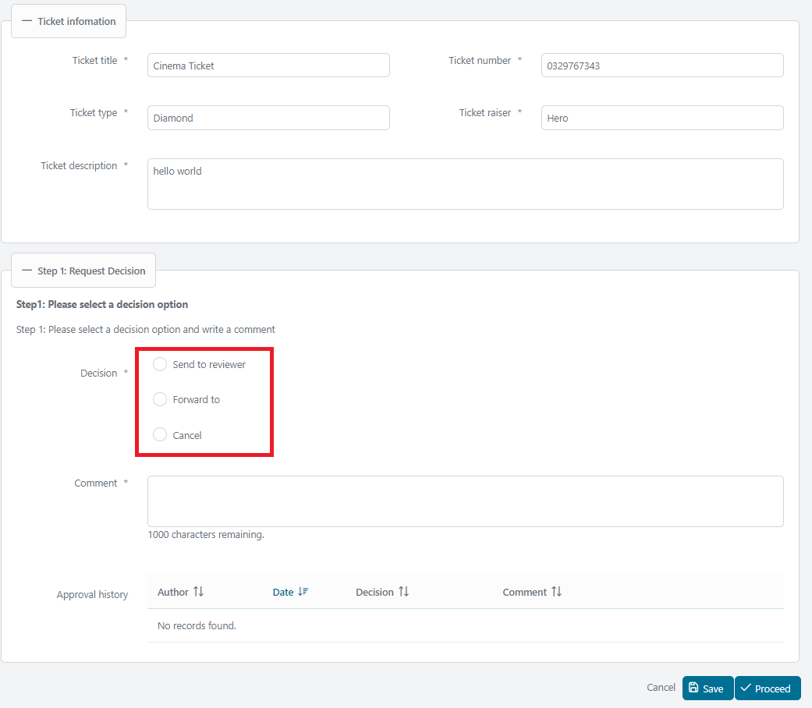
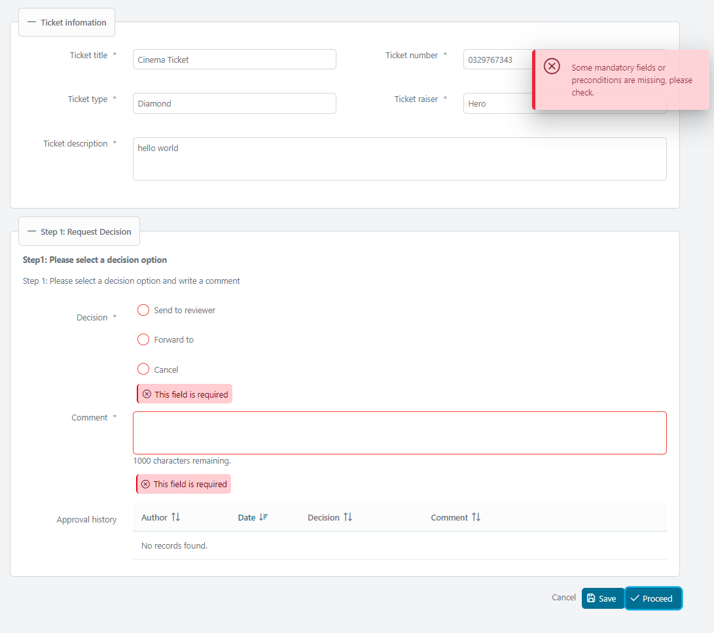
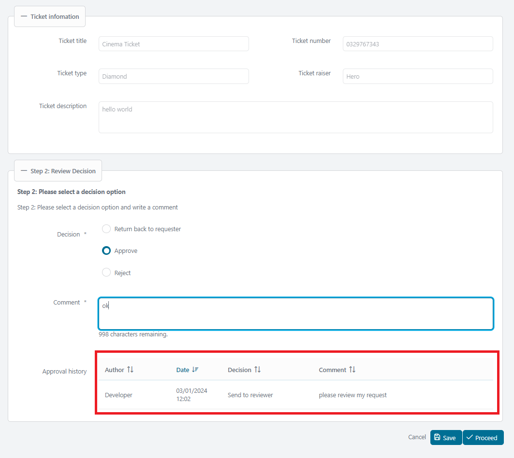
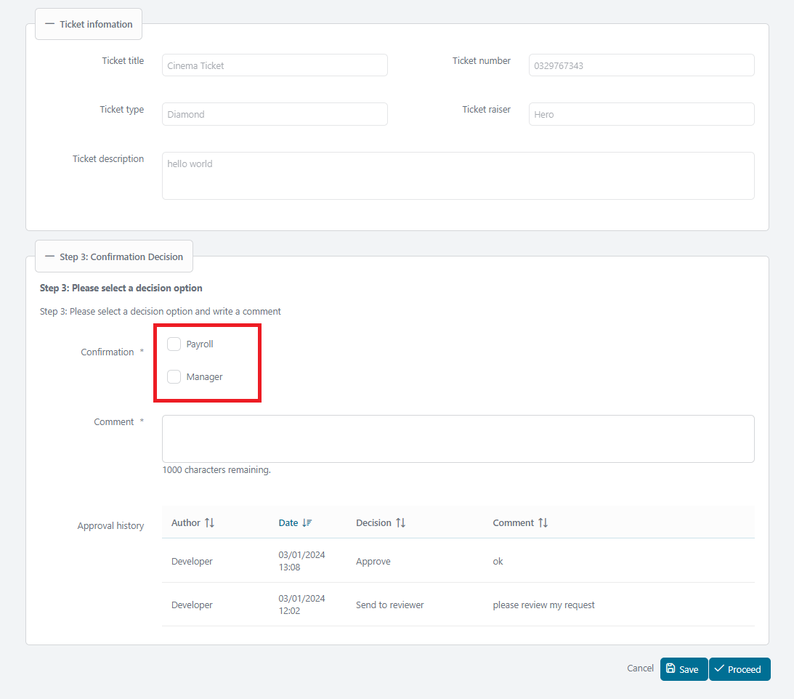
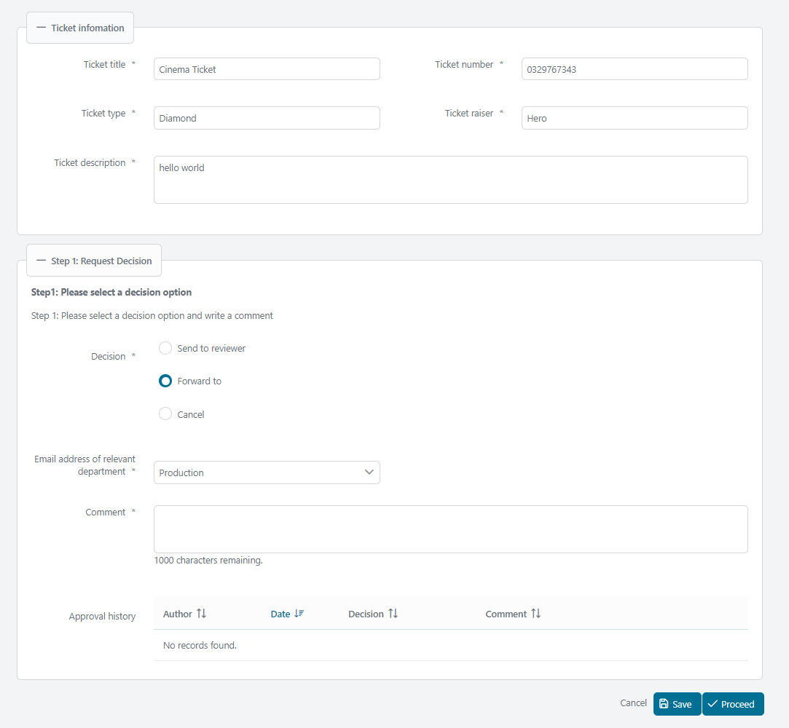

# Approval Decision Utils

Axon Ivy's Approval Decision Utils provides a standardized approach for implementing your approvals in any business process. This component:

- Gives you a standard pattern to make decisions and confirmations.
- Implements a comment function for better documentation.
- Provides a clear view of the ongoing approval history to meet regulatory, compliance, and transparency requirements.

## Demo 
The demo shows how to integrate Approval-Decision-Utils into your project.
There are 3 demos: 1 for a simple setup, 2 for different customizations with same process step:

### 1. Display decision option

### 2. Validate decision option

### 3. Track approval history

### 4. Select confirmation checkbox

## Setup

In the demo, you will find examples for 3 setups: 1 simple setup, 1 extended setup from BaseRequest with it's Approval Histories (CompositeTicketRequest), a separated setup : Entity TicketRequest is standalone with BaseRequest.

To integrate and use Approval Decision Utils in your project, you must provide a bean for the UI Component `ApprovalDecision`

#### Provide bean for the UI Component `ApprovalDecision`

Use the buit-in `DefaultApprovalDecisionBean` as in simple demo.
Or create a bean class extends `AbstractApprovalDecisionBean` with constructor parameters: histories, decisions, confirmations.

There are a pre-defined enum `ApprovalDecisionOption` (values: APPROVAL, REJECT) can be used as decisions of the bean.

For example:

	public class SimpleApprovalBean extends AbstractApprovalDecisionBean<ApprovalHistory, Long> {

		private static final long serialVersionUID = 1L;

		public SimpleApprovalBean() {
			super(null, List.of(ApprovalDecisionOption.values()), null);
		}

		@Override
		protected Class<ApprovalHistory> getApprovalHistoryType() {
			return ApprovalHistory.class;
		}
	}

In case of using your own enum, please override the bean method `getDecisionLabel(String decisionName)`,  where the decisionName is value string of your custom enum.

In the Demo, the bean `TicketApprovalDecisionBean` uses decision options from the enum `TicketProcessApprovalDecision`.	

### The UI component
     <ic:com.axonivy.utils.approvaldecision.ApprovalDecision
    	id="approvalDecision"
    	managedBean="#{managedBean.approvalDecisionBean}"
    	validatorId="#{managedBean.approvalDecisionBean.validatorId}"
    	fieldsetLegend="Request Decision"
    	fieldsetToggleable="#{true}"
    	fieldsetStyleClass="p-mt-3"
    	headline="Step 1: Pelease select a decision option"
    	headlinePanelStyleClass=""
    	headlineStyleClass="p-text-bold"
    	helpText="My help text"
    	helpTextPanelStyleClass=""
    	helpTextStyleClass=""
    	decisionRendered="#{managedBean.contentState.decisionRendered}"
    	decisionDisable="#{managedBean.contentState.decisionDisable}"
    	decisionRequired="#{managedBean.contentState.decisionRequired}"
    	listenerOnDecisionAction="#{managedBean.onChangeDecision()}"
    	componentToUpdateOnDecision="approvalDecision:dropDownListOfMails"
    	commentRendered="#{managedBean.contentState.commentRendered}"
    	commentRequired="#{managedBean.contentState.commentRequired}"
    	approvalHistoryRendered="#{managedBean.contentState.approvalHistoryRendered}">

#### Attributes

AttributeDescriptionDefault ValuemanagedBeanRequired. Must extend AbstractApprovalDecisionBean.

| Name                            | Description                                                                                       | Default                                 |
| :---------------------------- | :-------------------------------------------------------------------------------------------------- | :-------------------------------------- |
| `managedBean`                   | A bean extends class 'com.axonivy.utils.approvaldecision.managedbean.AbstractApprovalDecisionBean' |                                        |
| `isReadOnly`                    | Configures the component to be read-only.                                                         | `false`                                 |
| `fieldsetToggleable`            | Makes the fieldset toggleable.                                                                    | `false`                                 |
| `fieldsetLegend`                | Legend text of the fieldset.                                                                      | `Approval decision`                     |
| `fieldsetStyleClass`            | Style class of the fieldset.                                                                      |                                         |
| `headline`                      | Headline text inside the component.                                                               |                                         |
| `headlinePanelStyleClass`       | Style class for the panel of the headline.                                                        |                                         |
| `helpText`                      | Help text inside the component.                                                                   |                                         |
| `helpTextPanelStyleClass`       | Style class for the panel of the help text.                                                       |                                         |
| `helpTextStyleClass`            | Style class for the help text.                                                                    |                                         |
| `validatorId`                   | ID of the validator.                                                                              | `approvalDecisionValidator`             |
| `decisionLabel`                 | Label for the decision options.                                                                   |                                         |
| `decisionRequired`              | Mandatory check for decision.                                                                     | `true`                                  |
| `decisionRendered`              | Flag to render decision options.                                                                  | `true`                                  |
| `decisionRequiredMessage`       | Error message for mandatory decision check.                                                       | `CMS /Labels/RequiredFieldMessage`      |
| `decisionPanelStyleClass`       | Style class for the decision panel.                                                               |                                         |
| `listenerOnDecisionAction`      | Listener triggered when a decision is selected.                                                   |                                         |
| `componentToUpdateOnDecision`   | Components to update when a decision is selected.                                                 | `@this`                                 |
| `decisionCommentLabel`          | Label for the comment.                                                                            | `CMS /Labels/Comment`                   |
| `commentRequired`               | Mandatory check for comment.                                                                      | `true`                                  |
| `commentRendered`               | Flag to render comment.                                                                           | `true`                                  |
| `commentRequiredMessage`        | Error message for mandatory comment check.                                                        | `CMS /Labels/RequiredFieldMessage`      |
| `commentPanelStyleClass`        | Style class for the comment panel.                                                                |                                         |
| `confirmationRequired`          | Mandatory check for confirmation options.                                                         | `false`                                 |
| `confirmationRequiredMessage`   | Error message for mandatory confirmation check.                                                   | `CMS /Labels/RequiredFieldMessage`      |
| `confirmationPanelStyleClass`   | Style class for the confirmation panel.                                                           |                                         |
| `confirmationLabel`             | Label for the confirmation options.                                                               |                                         |
| `approvalHistoryRendered`       | Flag to render the approval history table.                                                        | `true`                                  |

#### Facets

---

- `customHeadline`: Custom headline. Use this when you need a more elaborate headline than simple text.

Example:

    <ic:com.axonivy.utils.approvaldecision.ApprovalDecision id="approvalDecision"
    managedBean="#{managedBean.approvalDecisionBean}">
    	<f:facet name="customHeadline">
    	  
Please check this <a href="www.google.com">Email</a> before proceed

    	</f:facet>
    </ic:com.axonivy.utils.approvaldecision.ApprovalDecision>

- `customHelpText`: Custom help text. Use this when you need a more elaborate help text than simple text.

Example:

    <ic:com.axonivy.utils.approvaldecision.ApprovalDecision id="approvalDecision"
    managedBean="#{managedBean.approvalDecisionBean}">
    	<f:facet name="customHelpText">
    	  
Please check this <a href="www.google.com">Email</a> before proceed

    	</f:facet>
    </ic:com.axonivy.utils.approvaldecision.ApprovalDecision>

- `customContent`: Custom content for special requirements.

Example: The following code adds the label `Email address of relevant department` and the dropdown list to the content.

    <ic:com.axonivy.utils.approvaldecision.ApprovalDecision id="approvalDecision"
    	managedBean="#{managedBean.approvalDecisionBean}">
    	<f:facet name="customContent">
    	  <h:panelGroup id="dropDownListOfMails">
    		  <h:panelGroup id="mail-panel"
    			layout="block"
    			styleClass="p-formgrid p-grid p-align-baseline ui-fluid"
    			rendered="#{managedBean.contentState.showDropdownOfMails}">
    			

    			  <p:outputLabel for="dropdownlist-mail"
    				value="Email address of relevant department">
    				*
    			  </p:outputLabel>
    			

    			

    			  <p:selectOneMenu id="dropdownlist-mail"
    				value="#{managedBean.request.forwardToMail}"
    				requiredMessage="#{ivy.cms.co('/Labels/RequiredFieldMessage')}">
    				<f:selectItem itemLabel="SelectOne" itemValue="" />
    				<f:selectItems
    				  value="#{managedBean.departmentMails.entrySet()}"
    				  var="department" itemLabel="#{department.key}"
    				  itemValue="#{department.value}" />
    				<f:validator validatorId="aprovalDecisionValidator" />
    			  </p:selectOneMenu>
    			  <p:message for="dropdownlist-mail" />
    			

    		  </h:panelGroup>
    		</h:panelGroup>
    	</f:facet>
    </ic:com.axonivy.utils.approvaldecision.ApprovalDecision>

#### Customize Approval history table (Optional)

The Approval history table is initially sorted by approval date in descending order. To customize the sort order, start by disabling the default sort through overriding the method `isApprovalHistoryTableSortDescending()`.

    @Override public boolean isApprovalHistoryTableSortDescending() { return false; }

Next, implement the custom sort by overriding the method `getApprovalHistoryTableSortField()`. The following fields are supported to sort:

- displayApprovalDate: Approval date.
- displayUserName: Name of the creator.
- comment: Comment.

Example:

    @Override public String getApprovalHistoryTableSortField() { return "displayUserName"; }
