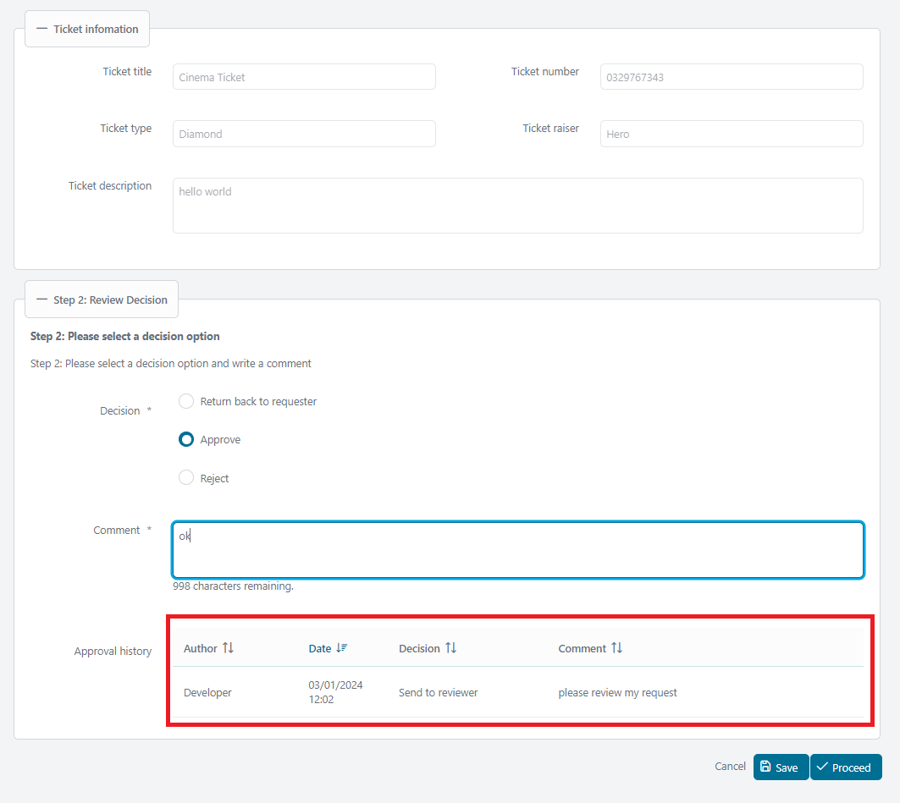
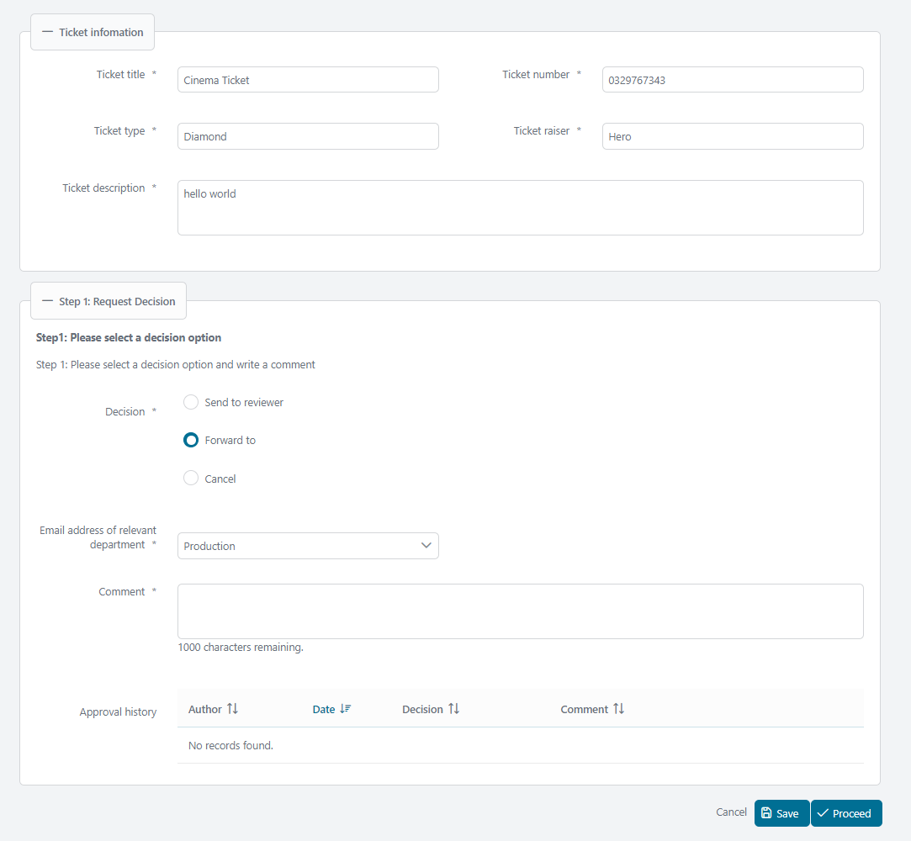

# Genehmigung Entscheid Utils

#Axon EfeusGenehmigung Entscheid Utils versieht ein normgerechtes Konzept für
implementieren eure Genehmigungen in irgendwelchem dienstlichen Arbeitsgang.
Diese Komponente:

- Gibt du ein tarifliches Muster zu machen Entscheide und Bestätigungen.
- Implementiert eine Kommentar Aufgabe für besser Dokumentation.
- Versieht einen klaren Ausblick von der laufenden Genehmigung Geschichte zu
  treffen #bestimmend, Zustimmung, und Transparenz Forderungen.

## Demo
Die Demo Vorstellungen zu integrieren wie Genehmigung-Entscheid-Utils hinein
eure Projekt. Dort sind 3 Demos: 1 für eine simple Einrichtung, 2 für
verschieden #Gewöhnung mit gleich Arbeitsgang Stufe:

### 1. Display Entscheid Option

### 2. Validier Entscheid Option

### 3. Fährte Genehmigung Geschichte

### 4. #Ausgewählt Bestätigung checkbox

## Einrichtung

In der Demo, du willst Beispiele für 3 Einrichtungen finden: 1 simple
Einrichtung, 1 #länger Einrichtung von BaseRequest mit es ist Genehmigung
Geschichten (CompositeTicketRequest), eine getrennte Einrichtung : Entität
TicketRequest ist eigenständig mit BaseRequest.

Zu integrieren und benutzen Genehmigung Entscheid Utils in eurem Projekt, du
musst eine Bohne versehen für die UI Komponente `ApprovalDecision`

#### Versieh Bohne für die UI Komponente `ApprovalDecision`

Benutz das buit-herein `DefaultApprovalDecisionBean` da in simpel Demo. Oder
schaffen eine Bohne Klasse erweitert `AbstractApprovalDecisionBean` mit Erbauer
Parameter: Geschichten, Entscheide, Bestätigungen.

Dort sind ein pre-#abgesteckt enum `ApprovalDecisionOption` (schätzt:
GENEHMIGUNG, ABSONDERUNG) kann sein benutzt da Entscheide von der Bohne.

Beispielsweise:

    public class SimpleApprovalBean extends AbstractApprovalDecisionBean<ApprovalHistory, Long> {

    	private static final long serialVersionUID = 1L;

    	public SimpleApprovalBean() {
    		super(null, List.of(ApprovalDecisionOption.values()), null);
    	}

    	@Override
    	protected Class<ApprovalHistory> getApprovalHistoryType() {
    		return ApprovalHistory.class;
    	}
    }

#Im Fall von benutzen eure eigenes enum, bitte Überbrückung die Bohne Methode
`getDecisionLabel(#Aufreihen decisionName)`, #wo die decisionName ist Wert
Schnur von eure #benutzerdefiniert enum.

In der Demo, die Bohne `TicketApprovalDecisionBean` Nutzungen Entscheid Optionen
von die enum `TicketProcessApprovalDecision`.

### Das UI Komponente
     <ic:com.axonivy.utils.approvaldecision.ApprovalDecision
    	id="approvalDecision"
    	managedBean="#{managedBean.approvalDecisionBean}"
    	validatorId="#{managedBean.approvalDecisionBean.validatorId}"
    	fieldsetLegend="Request Decision"
    	fieldsetToggleable="#{true}"
    	fieldsetStyleClass="p-mt-3"
    	headline="Step 1: Pelease select a decision option"
    	headlinePanelStyleClass=""
    	headlineStyleClass="p-text-bold"
    	helpText="My help text"
    	helpTextPanelStyleClass=""
    	helpTextStyleClass=""
    	decisionRendered="#{managedBean.contentState.decisionRendered}"
    	decisionDisable="#{managedBean.contentState.decisionDisable}"
    	decisionRequired="#{managedBean.contentState.decisionRequired}"
    	listenerOnDecisionAction="#{managedBean.onChangeDecision()}"
    	componentToUpdateOnDecision="approvalDecision:dropDownListOfMails"
    	commentRendered="#{managedBean.contentState.commentRendered}"
    	commentRequired="#{managedBean.contentState.commentRequired}"
    	approvalHistoryRendered="#{managedBean.contentState.approvalHistoryRendered}">

#### Attribute

AttributeDescriptionDefault ValuemanagedBeanRequired. Müssen erweitern
AbstractApprovalDecisionBean.

| Name                          | Steckbrief                                                                                                | Vorgabe                               |
| ----------------------------- | --------------------------------------------------------------------------------------------------------- | ------------------------------------- |
| `managedBean`                 | Eine Bohne erweitert Klasse scom.axonivy.utils.approvaldecision.managedbean.AbstractApprovalDecisionBeans |                                       |
| `isReadOnly`                  | Konfiguriert die Komponente zu sein gelesen-einzige.                                                      | `Falsch`                              |
| `fieldsetToggleable`          | Herstellungen die fieldset toggleable.                                                                    | `Falsch`                              |
| `fieldsetLegend`              | Legende Text von der fieldset.                                                                            | `Genehmigung Entscheid`               |
| `fieldsetStyleClass`          | Stil Klasse von die fieldset.                                                                             |                                       |
| `Schlagzeile`                 | Schlagzeile Text innerhalb die Komponente.                                                                |                                       |
| `headlinePanelStyleClass`     | Stil Klasse für die Diskussionsrunde von der Schlagzeile.                                                 |                                       |
| `helpText`                    | Hilfe Text innerhalb die Komponente.                                                                      |                                       |
| `helpTextPanelStyleClass`     | Stil Klasse für die Diskussionsrunde von den Hilfe Text.                                                  |                                       |
| `helpTextStyleClass`          | Stil Klasse für den Hilfe Text.                                                                           |                                       |
| `validatorId`                 | ID Von dem Prüfer.                                                                                        | `approvalDecisionValidator`           |
| `decisionLabel`               | Etikett für die Entscheid Optionen.                                                                       |                                       |
| `decisionRequired`            | Obligatorische Kontrolle für Entscheid.                                                                   | `Wahr`                                |
| `decisionRendered`            | Fahne zu #ausschmelzen Entscheid Optionen.                                                                | `Wahr`                                |
| `decisionRequiredMessage`     | Fehler Meldung für obligatorisch Entscheid Kontrolle.                                                     | `CMS /Etiketten/RequiredFieldMessage` |
| `decisionPanelStyleClass`     | Stil Klasse für die Entscheid Diskussionsrunde.                                                           |                                       |
| `listenerOnDecisionAction`    | Zuhörer löste aus #wann ist #auswählen einen Entscheid.                                                   |                                       |
| `componentToUpdateOnDecision` | Komponenten zu verbessern als ist #auswählen einen Entscheid.                                             | `@Dies`                               |
| `decisionCommentLabel`        | Etikett für den Kommentar.                                                                                | `CMS /Etiketten/Kommentar`            |
| `commentRequired`             | Obligatorische Kontrolle für kommentier.                                                                  | `Wahr`                                |
| `commentRendered`             | Fahne zu #ausschmelzen Kommentar.                                                                         | `Wahr`                                |
| `commentRequiredMessage`      | Fehler Meldung für obligatorisch Kommentar Kontrolle.                                                     | `CMS /Etiketten/RequiredFieldMessage` |
| `commentPanelStyleClass`      | Stil Klasse für die Kommentar Diskussionsrunde.                                                           |                                       |
| `confirmationRequired`        | Obligatorische Kontrolle für Bestätigung Optionen.                                                        | `Falsch`                              |
| `confirmationRequiredMessage` | Fehler Meldung für obligatorisch Bestätigung Kontrolle.                                                   | `CMS /Etiketten/RequiredFieldMessage` |
| `confirmationPanelStyleClass` | Stil Klasse für die Bestätigung Diskussionsrunde.                                                         |                                       |
| `confirmationLabel`           | Etikett für die Bestätigung Optionen.                                                                     |                                       |
| `approvalHistoryRendered`     | Fahne zu #ausschmelzen die Genehmigung Geschichte Tisch.                                                  | `Wahr`                                |

#### Facetten

---

- `customHeadline`: #Benutzerdefiniert Schlagzeile. Benutz dies als brauchst du
  eine More verfeinert Schlagzeile als simplen Text.

Beispiel:

    <ic:com.axonivy.utils.approvaldecision.ApprovalDecision id="approvalDecision"
    managedBean="#{managedBean.approvalDecisionBean}">
    	<f:facet name="customHeadline">
    	  
Please check this <a href="www.google.com">Email</a> before proceed

    	</f:facet>
    </ic:com.axonivy.utils.approvaldecision.ApprovalDecision>

- `customHelpText`: #Benutzerdefiniert Hilfe Text. Benutz dies als brauchst du
  eine More verfeinert Hilfe Text als simplen Text.

Beispiel:

    <ic:com.axonivy.utils.approvaldecision.ApprovalDecision id="approvalDecision"
    managedBean="#{managedBean.approvalDecisionBean}">
    	<f:facet name="customHelpText">
    	  
Please check this <a href="www.google.com">Email</a> before proceed

    	</f:facet>
    </ic:com.axonivy.utils.approvaldecision.ApprovalDecision>

- `customContent`: #Benutzerdefiniert Inhalt für speziell Forderungen.

Beispiel: Der folgende Code fügt zu das Etikett `#Email Adresse von relevant
Abteilung` und die dropdown Liste zu dem Inhalt.

    <ic:com.axonivy.utils.approvaldecision.ApprovalDecision id="approvalDecision"
    	managedBean="#{managedBean.approvalDecisionBean}">
    	<f:facet name="customContent">
    	  <h:panelGroup id="dropDownListOfMails">
    		  <h:panelGroup id="mail-panel"
    			layout="block"
    			styleClass="p-formgrid p-grid p-align-baseline ui-fluid"
    			rendered="#{managedBean.contentState.showDropdownOfMails}">
    			

    			  <p:outputLabel for="dropdownlist-mail"
    				value="Email address of relevant department">
    				*
    			  </p:outputLabel>
    			

    			

    			  <p:selectOneMenu id="dropdownlist-mail"
    				value="#{managedBean.request.forwardToMail}"
    				requiredMessage="#{ivy.cms.co('/Labels/RequiredFieldMessage')}">
    				<f:selectItem itemLabel="SelectOne" itemValue="" />
    				<f:selectItems
    				  value="#{managedBean.departmentMails.entrySet()}"
    				  var="department" itemLabel="#{department.key}"
    				  itemValue="#{department.value}" />
    				<f:validator validatorId="aprovalDecisionValidator" />
    			  </p:selectOneMenu>
    			  <p:message for="dropdownlist-mail" />
    			

    		  </h:panelGroup>
    		</h:panelGroup>
    	</f:facet>
    </ic:com.axonivy.utils.approvaldecision.ApprovalDecision>

#### Pass an Genehmigung Geschichte Tisch (Optional)

Die Genehmigung Geschichte Tisch ist anfänglich bei Genehmigung geordnet Datum
in #absteigend Befehl. Zu anpassen der Sorte Befehl, Start ausschalten mal die
#voreingestellt Sorte durch #außer Kraft setzend die Methode
`isApprovalHistoryTableSortDescending()`.

    @Override public boolean isApprovalHistoryTableSortDescending() { return false; }

#Nächste, implementier die #benutzerdefiniert Sorte mal #außer Kraft setzend die
Methode `getApprovalHistoryTableSortField()`. Die folgenden Felder sind
unterstützt zu ordnen:

- displayApprovalDate: Genehmigung Datum.
- displayUserName: Name von dem Schöpfer.
- Kommentar: Kommentar.

Beispiel:

    @Override public String getApprovalHistoryTableSortField() { return "displayUserName"; }
